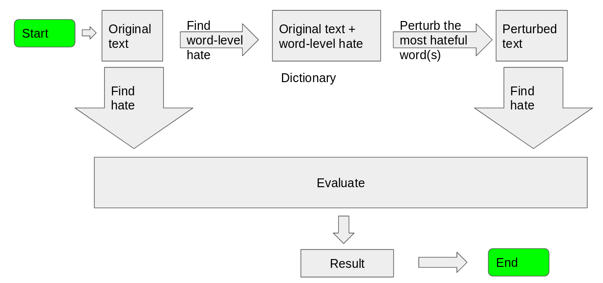

# N0t_Hate_5peech

## Overview:


## To generate toxicity scores:

```bash
python getToxicity.py -i <inputfilename>
```
This will generate a new file with filename: <inputfilename_toxicity>


## Instructions:
In the data folder, there is a file named mondal_json_v2 which is a CSV file The stucture of the CSV file contain the line number in the first columns, perspective API toxicity score and the text of the tweet.
Given a file in the format described above, if you want to calculate the toxicity of every line of sentence, simply run the file "getToxicity.py -i <filename>". This would ignore the second column of CSV and re-populate it with the Perspective API's toxicity score and save the file as <filename>_toxicity. All the outputs of this command could be found in the perturbed_data folder with which contains toxicities of all the perturbed files. After the following setup, data/mondal_json_v2 will be original file while the perturbed data folder contains the perturbed files with their toxicities.
  
Evaluation:
All the evaluation scripts can be found in evaluation.py.
